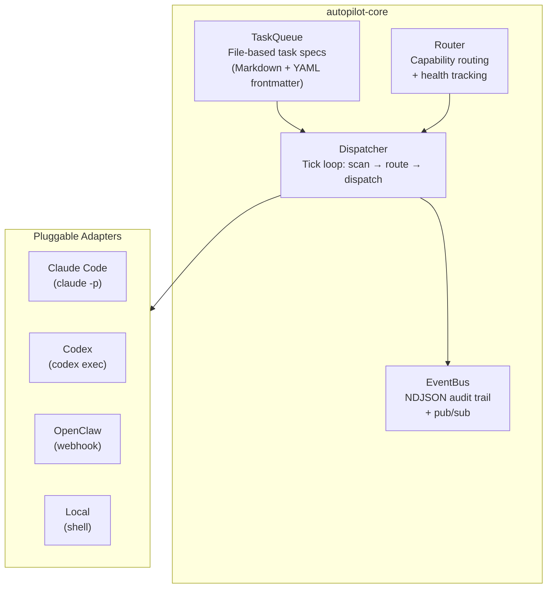

# Autopilot

[](LICENSE)
[](https://python.org)

**Open-source control plane for autonomous AI agent clusters.**

Autopilot is the ops layer that agent frameworks (AutoGen, CrewAI, LangGraph) are missing. It provides task queuing, capability-based routing, auditable execution, and pluggable executor adapters — turning a collection of AI agents into a self-orchestrating system.

Extracted and generalized from [WuKong AI](https://wukongai.io)'s production multi-agent cluster, which has been running autonomously since early 2026.

## Architecture



## Features

- **Task Queue** — File-based tasks as Markdown with YAML frontmatter. Human-readable, git-friendly, zero database required.
- **Capability Router** — Routes tasks to the best executor based on explicit constraints, historical performance, and health scores. Learns from outcomes.
- **Dispatcher** — Tick-based dispatch loop with concurrency control, lease-based claiming, dependency tracking, and protected path enforcement.
- **Event Bus** — Append-only NDJSON event bus with file locking, pub/sub channels, TTL, and tail-read optimization. Zero external dependencies.
- **Pluggable Adapters** — Claude Code, Codex, OpenClaw, and local shell executors. Easy to add your own.
- **Auditable** — Every routing decision, dispatch, and execution result is recorded as an event.

## Quickstart

```bash
# Install
pip install -e ".[dev]"

# Create a task
autopilotctl task create --title "Fix the login bug" --priority high --type bugfix

# List tasks
autopilotctl task list

# Run a dispatch cycle (with local executor)
autopilotctl dispatch tick

# View events
autopilotctl events tail
```

### Run the demo

```bash
python examples/quickstart/run_demo.py
```

This creates tasks, dispatches them to a local shell executor, and shows the full event trail.

## Project Structure

```
autopilot/
├── autopilot_core/          # Core library (zero external deps)
│   ├── task.py              # Task model + state machine
│   ├── queue.py             # File-based task queue
│   ├── router.py            # Capability routing engine
│   ├── dispatcher.py        # Tick-based dispatcher
│   ├── event_bus.py         # NDJSON event bus
│   └── cli.py               # CLI (autopilotctl)
├── adapters/                # Executor adapters
│   ├── base.py              # Abstract base adapter
│   ├── local.py             # Local shell executor
│   ├── claude_code.py       # Claude Code (headless)
│   └── openclaw.py          # OpenClaw webhook
├── plugins/                 # Extensible plugins
├── tests/                   # 65 tests, all passing
├── examples/quickstart/     # Working demo
├── pyproject.toml
└── LICENSE                  # Apache-2.0
```

## Core Concepts

### Tasks

Tasks are Markdown files with YAML frontmatter:

```markdown
---
id: req-20260314-a1b2c3d4
title: Fix authentication bug
status: pending
priority: high
executor: claude-code
task_type: bugfix
timeout_minutes: 30
tags: [bugfix, auth]
---

The login endpoint returns 500 when email contains a plus sign.
```

Status transitions: `pending → claimed → in_progress → done/blocked/cancelled`

### Routing

The router selects executors using three layers:

1. **Explicit** — `executor: claude-code` in the task spec (hard constraint)
2. **Score-based** — Historical success rates per executor per task type
3. **Resource** — Concurrency slots, health scores, cooldown

### Event Bus

All events are NDJSON with a standard schema:

```json
{"id": "evt-...", "event_type": "dispatch.decision", "timestamp": "2026-...", "source": "autopilot", "payload": {...}}
```

Supports pub/sub channels with TTL for cross-session coordination.

## Development

```bash
# Run tests
python -m pytest tests/ -v

# Lint
ruff check .
```

## Origin

Autopilot's patterns were extracted from [agent-ops](https://github.com/WuKongAI-CMU/agent-ops), the operational workspace powering WuKong AI's autonomous multi-agent cluster. The core ideas — file-based task queues, NDJSON event buses, capability-based routing, and cross-model review — were battle-tested across 1500+ autonomous agent runs before being generalized into this library.

## License

Apache License 2.0 — see [LICENSE](LICENSE).

Copyright 2026 WuKong AI.
